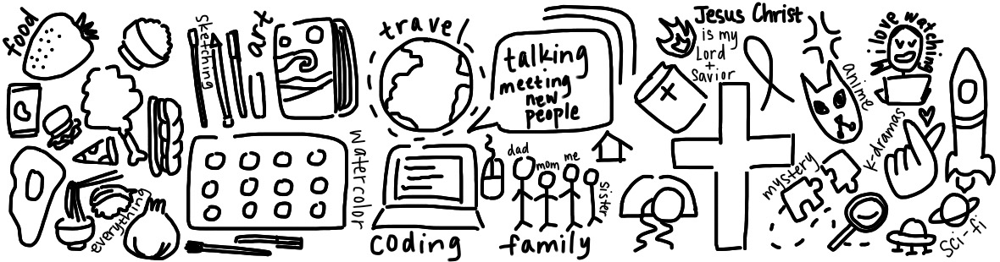

# Ellie Huo's User Page
## Favorite Programming Language: Java 
##### email: elliehuo24596@gmail.com

**bold**
*italicized*
~~strikethrough~~
**bold and nested _italic_**
***All bold and italic***

Ellie says:
> "I love fried chicken"

```
Hello world
```

[My Personal Website](https://elhuo.github.io/Personal-Website/)

[section link](README.md)
[relative link to myself](README.md)

- KBBQ
- Soup Dumplings
- Carne Asada Fries

1. One
2. Two
3. Three

Nested List
- Nested in the Nested List
  - Nested in the Nested List

- [x] Drink water
- [ ] Smile
- [ ] Be happy




<!--
**elhuo/elhuo** is a ✨ _special_ ✨ repository because its `README.md` (this file) appears on your GitHub profile.

Here are some ideas to get you started:

- 🔭 I’m currently working on ...
- 🌱 I’m currently learning ...
- 👯 I’m looking to collaborate on ...
- 🤔 I’m looking for help with ...
- 💬 Ask me about ...
- 📫 How to reach me: ...
- 😄 Pronouns: ...
- ⚡ Fun fact: ...
-->
